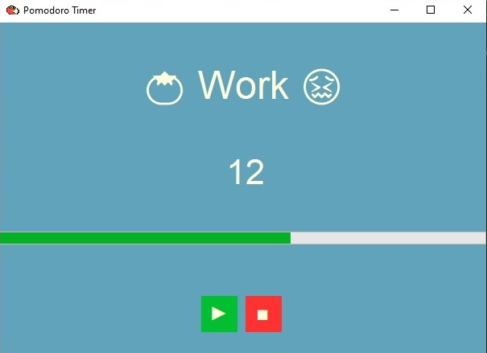

# Pomodoro Timer

* A simple Pomodoro Timer built with .NET Windows Forms (C#) to help users manage work and break sessions efficiently.

---

---

## Features
1. Start/Stop the timer
2. Work mode and break mode tracking
3. Visual progress bar for time tracking
4. Sound notifications
5. Customizable work and break durations

## Installation
1. Clone the repository.
2. Open the project in Visual Studio.
3. Build and run the system.

## How Pomodoro Timer Works
* The timer runs for 25 minutes (or your set duration).
* After that, a 5 minute break starts automatically.
* The cycle repeats until stopped.

